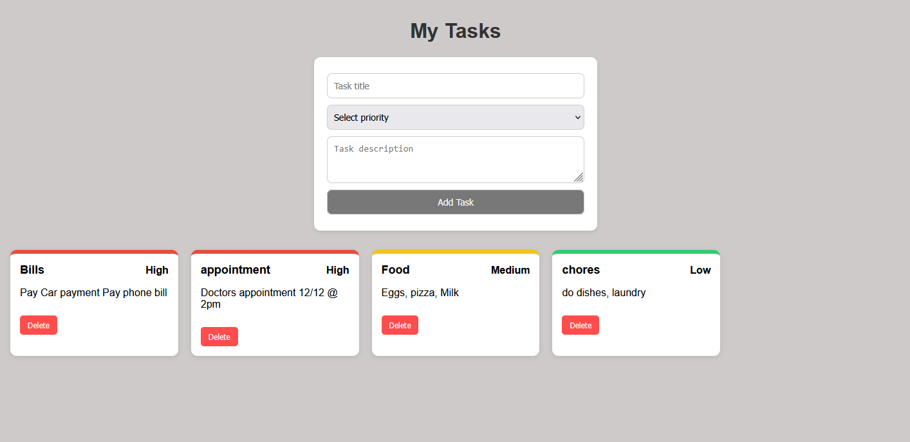

## Task Application

This is a simple application using Python and Flask to manage tasks. It is fully functional, but it is in a very rudimentary state.

Functionality:
- Create tasks with a title and description
- Ordered by user priority level (High, Medium, low)
- Delete Tasks
- Stored locally in a JSON file so they persist between sessions
